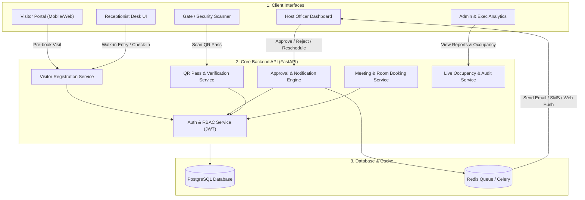
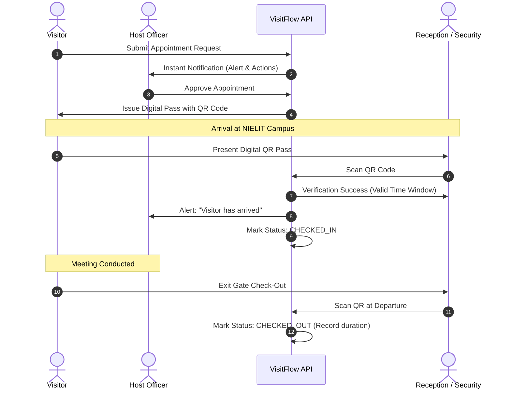
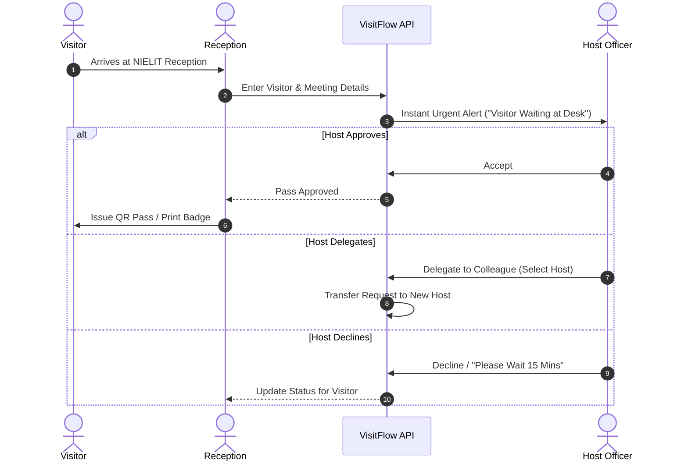
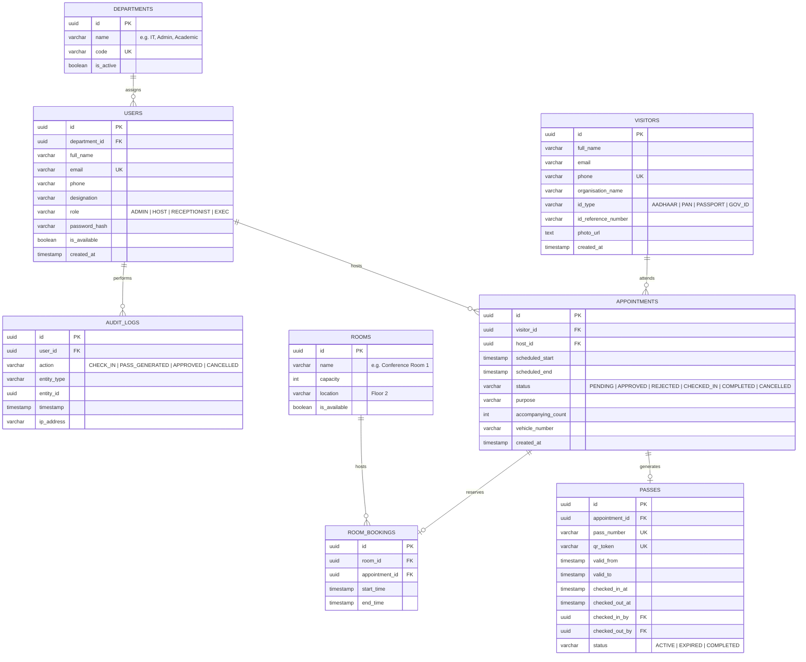

# Architecture & Technical Design Document (ARCHITECTURE.md)

**Project:** NIELIT Visitor & Meeting Management System (`VisitFlow`)  
**Scope:** Core MVP Architecture & Solution Specification  
**Deployment Target:** NIELIT Bhubaneswar  

---

## 1. Project Idea & Core Problem

### 1.1 The Idea
Replace traditional physical paper visitor registers at NIELIT Bhubaneswar with a unified digital visitor and meeting management platform. The system streamlines receiving, approving, tracking, and logging visitors, while managing conference room bookings and institutional security.

### 1.2 The Problem
Manual paper registers cause significant operational bottlenecks:
* **No Searchability:** Unable to query past visitor records, verification details, or historical visit patterns.
* **No Advance Planning:** Visitors arrive unannounced without pre-scheduled slot coordination.
* **Manual Communication Delay:** Receptionists must manually phone or walk over to officers to announce visitors.
* **Zero Premise Visibility:** Management cannot answer *"who is currently inside the building right now?"* during audits or emergencies.
* **No Approval Trail:** Visits lack formalized digital host acceptance, re-routing, or audit logs.
* **Room Scheduling Conflicts:** Meeting rooms and seminar halls face double-booking and untracked occupancy.

---

## 2. The Solution Architecture

The solution provides an automated, end-to-end digital lifecycle for both **advance appointments** and **walk-in visitors**.



---

## 3. End-to-End System Workflows

### 3.1 Advance Appointment Flow
1. **Request Creation:** The visitor submits an appointment request online (selecting host officer, department, purpose, date, and expected time). Alternatively, an officer initiates an invitation.
2. **Host Approval:** The host receives an immediate alert (Dashboard / Email / SMS) with one-click actions: **Accept**, **Reschedule**, or **Reject**.
3. **Pass Generation:** Upon approval, the system generates a secure digital pass containing a unique, time-bounded **QR code** and emails it to the visitor.
4. **Arrival Check-In:** The visitor presents the QR pass at NIELIT reception or entry gate. The scanner validates the pass and marks the visitor as **Checked-In**.
5. **Host Alert:** The host receives an automated notification: *"Your visitor has arrived at reception."*
6. **Meeting & Check-Out:** Following the meeting, the visitor checks out at the gate. The exit timestamp and total duration are recorded.



---

### 3.2 Walk-In Visitor Flow
1. **Reception Entry:** Visitor arrives at reception. The receptionist inputs visitor details (Name, Phone, Email, Organization, ID Type, Host to meet, Purpose).
2. **Instant Host Dispatch:** The system dispatches an urgent alert to the host officer's dashboard.
3. **Host Decision:**
   * **Accept:** Generates visitor pass immediately.
   * **Delegate:** Re-routes the visit to an available colleague in the department.
   * **Wait / Reschedule:** Requests the visitor to wait $N$ minutes or reschedule.
4. **Pass Issuance:** Reception prints a thermal badge or issues an SMS/digital QR pass for entry.



---

## 4. System Modules Breakdown

### Module A: Visitor Registration & Management
* **Data Fields Captured:**
  * Full Name, Mobile Number, Email Address
  * Organization / Institution, Designation
  * Official ID Type (Aadhaar, PAN, Driving License, College ID) & Reference Number
  * Photograph (Webcam capture at reception or upload)
  * Accompanying persons count & vehicle number (optional)
* **Unique Identification:** Generates a unique system tracking ID (`VIS-YYYYMMDD-XXXX`).
* **Visitor History:** Tracks recurring visitors by mobile/ID hash to auto-fill details on subsequent visits.

### Module B: Appointment & Scheduling Engine
* Allows officers to pre-schedule meetings and invite external guests.
* Checks officer calendar availability to prevent time overlaps.
* Handles status transitions: `PENDING` $\rightarrow$ `APPROVED` $\rightarrow$ `CHECKED_IN` $\rightarrow$ `COMPLETED` / `CANCELLED` / `NO_SHOW`.

### Module C: Real-Time Host Notification Engine
* Triggers real-time alerts when:
  * A new appointment request is submitted.
  * A walk-in visitor arrives at reception.
  * A visitor checks into the facility.
* Channels: Web Dashboard (WebSocket / Server-Sent Events), Email (SMTP), and optional SMS.
* Quick actions: Single-click **Accept**, **Reschedule**, or **Please Wait**.

### Module D: QR-Based Digital Pass & Gate Check-in
* **QR Pass Contents:** Encrypted or signed token containing:
  * Appointment ID, Visitor Name, Host Name & Department
  * Validity start and end window
* **Gate Verification:** Security scanner validates the QR code via webcam or optical scanner.
* **Auto-Expiration:** Passes automatically expire after the scheduled meeting duration plus grace buffer.
* **Audit Trail:** Exact timestamp and gate number recorded on both entry and exit.

### Module E: Meeting & Room Management
* **Room Inventory:** Manages Conference Rooms, Seminar Halls, and Discussion Rooms.
* **Conflict Prevention:** Validates room schedule before confirming a meeting reservation to prevent double-booking.
* **Post-Meeting Logs:** Allows hosts to record meeting completion notes and action items.

### Module F: Emergency Occupancy & Live Dashboard
* **Live On-Premises Roster:** Displays a real-time count and table of all visitors currently inside the facility (`CHECKED_IN` but not yet `CHECKED_OUT`).
* **Safety Evacuation Roster:** Single-click export of currently inside persons for emergency headcounts.
* **Key Metrics:**
  * Daily / Monthly visitor volume
  * Visits by department and purpose
  * Peak visiting hours analysis
  * Average visit duration

---

## 5. Role-Based Access Control (RBAC)

| Capability | Receptionist | Employee / Host | Administrator | Executive Management |
| :--- | :---: | :---: | :---: | :---: |
| Register Walk-in Visitors | ✅ | ❌ | ✅ | ❌ |
| Scan QR Check-in / Check-out | ✅ | ❌ | ✅ | ❌ |
| Issue Visitor Passes | ✅ | ❌ | ✅ | ❌ |
| Pre-Schedule Appointments | ✅ | ✅ | ✅ | ❌ |
| Approve / Reject Meeting Requests | ❌ | ✅ (Own) | ✅ | ❌ |
| Reserve Meeting Rooms | ❌ | ✅ | ✅ | ❌ |
| View Live On-Premises Count | ✅ | ❌ | ✅ | ✅ |
| Manage Users, Depts & Rooms | ❌ | ❌ | ✅ | ❌ |
| Access Analytics & Reports | ❌ | ❌ | ✅ | ✅ |
| View Security Audit Logs | ❌ | ❌ | ✅ | ✅ |

---

## 6. Database Schema Design (PostgreSQL)



---

## 7. Technology Stack

* **Frontend:**
  * **Framework:** Next.js (React, TypeScript)
  * **Styling:** Tailwind CSS (Modern, clean institutional UI)
  * **State & Data Fetching:** TanStack React Query / SWR
  * **QR Code:** `html5-qrcode` / `react-qr-code` for scanning and rendering
  * **Charts:** Recharts (Analytics dashboard)

* **Backend API:**
  * **Framework:** Python FastAPI (Asynchronous REST API, typed with Pydantic)
  * **ORM & Database:** SQLAlchemy 2.0 (Async) with PostgreSQL
  * **Authentication:** JWT (JSON Web Tokens) with Role-Based Access Control
  * **QR Generation:** Python `qrcode` library

* **Infrastructure & Deployment:**
  * **Database:** PostgreSQL 15+
  * **Cache / Background Tasks:** Redis (for async email/SMS dispatch)
  * **Hosting:** Docker Compose on Ubuntu Linux Server + Nginx Reverse Proxy

---

## 8. MVP Development Phasing & Deliverables

```text
Phase 1: Foundation (Core Models & Auth)
├── User & Department management
├── Role-based authentication (Admin, Host, Receptionist)
└── Base UI Shell & Layout

Phase 2: Visitor Workflows
├── Visitor Registration & History
├── Advance Appointment Request & Host Approval/Reject actions
└── Walk-in Reception Desk with instant host notification

Phase 3: Passes & Hardware Scanner Integration
├── Secure QR Pass generation
├── Gate camera check-in and check-out scanning
└── Real-time Emergency On-Premises Occupancy view

Phase 4: Meeting Rooms & Executive Analytics
├── Room booking with schedule collision detection
├── Daily / Monthly visitor statistics & charts
└── System Audit Logging & User Manual
```

---

## 9. Summary: How This Solves the Problem

| Current Manual Bottleneck | VisitFlow Solution |
| :--- | :--- |
| Paper register hard to search | Centralized database with instant phone/name/date search |
| No advance booking | Public/Guest appointment booking with host pre-approval |
| Receptionist walks or calls host | Instant web push and email notifications with 1-click action |
| Unknown who is currently inside | Real-time live occupancy counter and emergency roll-call list |
| No meeting room coordination | Integrated room booking with automated collision prevention |
| Paper visitor slips easily forged | Digitally signed, auto-expiring QR code passes |
